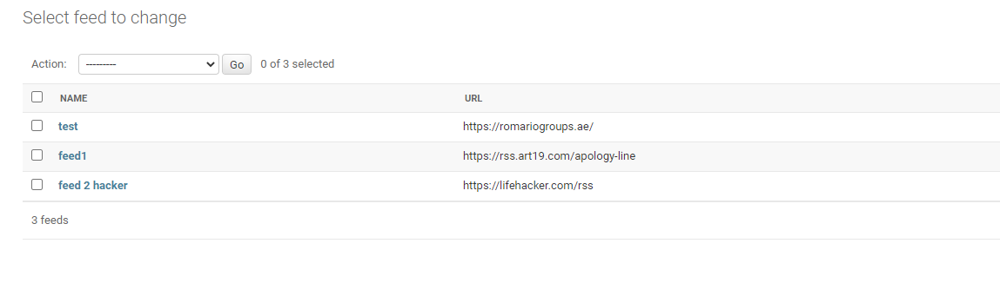
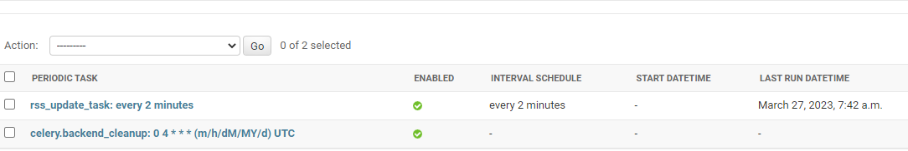
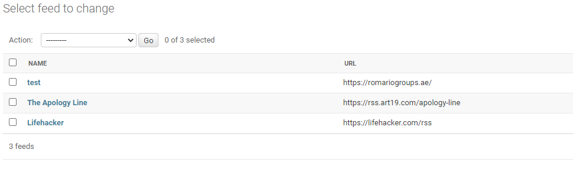
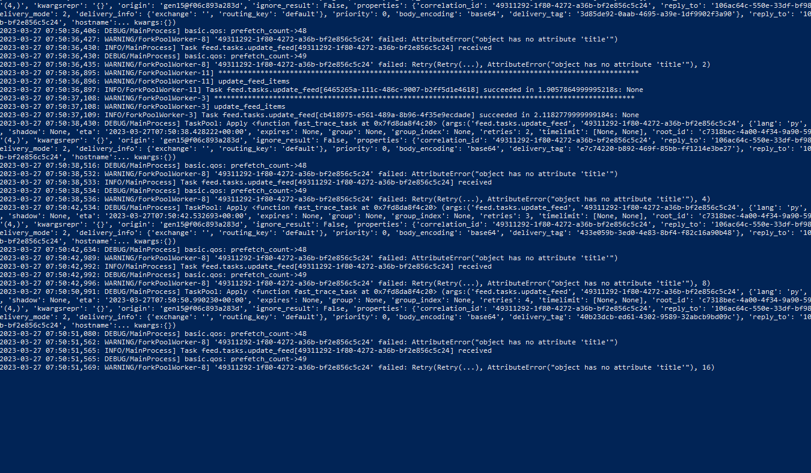
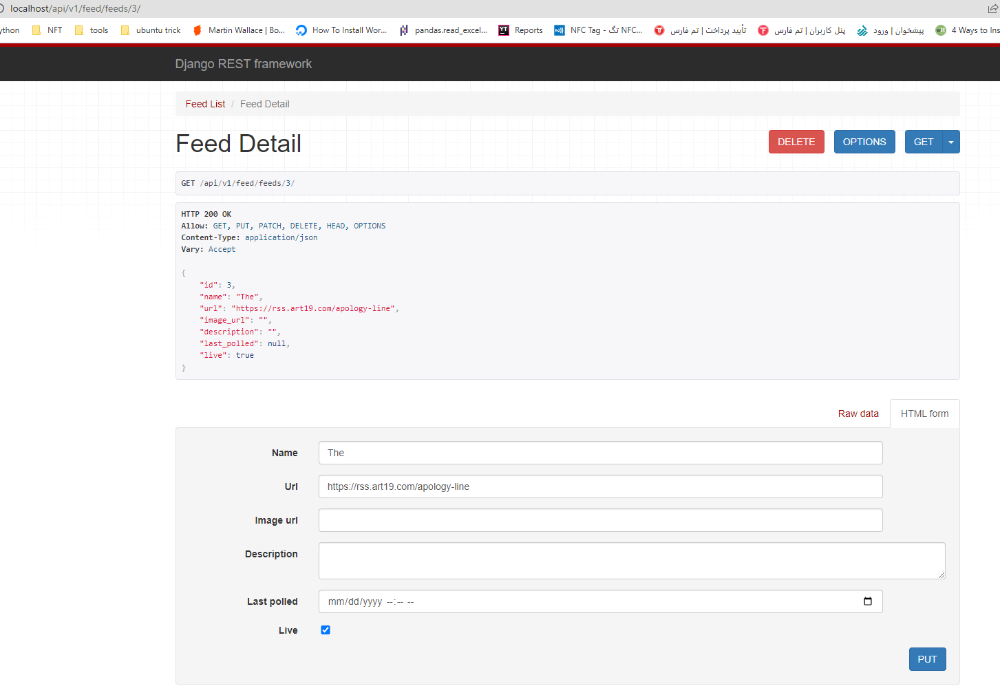
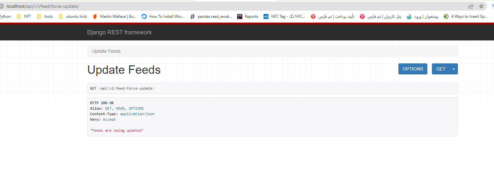
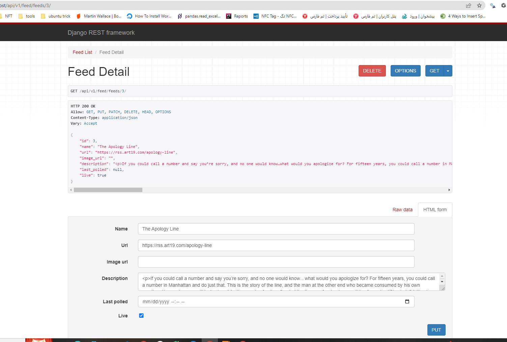

# RSS Feed scraper


 This is a Django-based web application that aggregates RSS feeds. It includes a set of RESTful APIs to allow the front-end to interact with the back-end services.
### Getting Started
To run the project, simply clone it from GitHub and use docker-compose to start the service. Follow the steps below:

 1. Clone the repository
 2. In the project directory, run: 
```shell
docker-compose up -d --build
```
 3. Navigate to http://localhost in your web browser

### note:
```text
1. you are free to change dockers image versions, please check them before starting
```
## What I do for this project:
1. Fix **settings.py** file 
2. Fix **docker-compose** file and **Dockerfile**
3. Add **nginx** docker file and add it to **docker-compose**
4. Write celery task to update RSS Feeds
5. Add these endpoints with Rest


## Endpoints

Once the project is running, the following endpoints can be used to interact with the application.


| endpont                     | methods | description                                                                                                                                                                             |
|-----------------------------|---------|-----------------------------------------------------------------------------------------------------------------------------------------------------------------------------------------|
| /api/v1/feed/feeds          | GET     | This endpoint returns a list of all feeds currently in the database.
| /api/v1/feed/feed/<pk>      | GET/PUT |This endpoint returns a detail view for the given feed, where pk is the primary key of the feed.
| /api/v1/feed/force-update/  | GET     | This endpoint triggers a Celery task to update all feeds in the database.


## Task Queue

The application uses Celery to support background task processing. The UpdateFeeds task is responsible for retrieving and updating RSS feeds in the database. This task is triggered periodically via a scheduled Celery beat.

## Database
The application uses a PostgreSQL database to store feed data. For development purposes, a SQLite database is used.


some images for example:
1. feed1 and feed2 have correct url and test has wrong url

2. you can see I add rss_update task for periodic 2 minutes

3. after task run you see feed1 and feed2 title updated

4. in docker logs in celery worker you can see that task which has error reported to some times


5. for force update you can these images:
feed before update

run force update:

feed after update :
